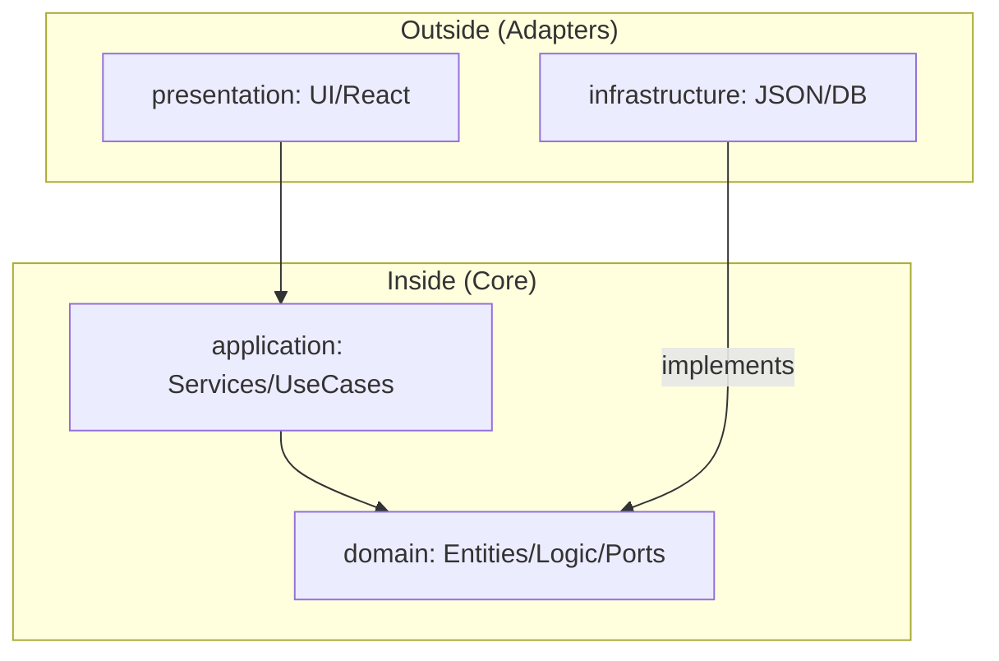

# ヘキサゴナルアーキテクチャの設計とクイズ表示のフロー

このプロジェクトでは、変更に強く、テストが容易なコードを目指して **ヘキサゴナルアーキテクチャ（Hexagonal Architecture / Ports and Adapters）** を採用しています。

## 1. アーキテクチャの概要

ヘキサゴナルアーキテクチャの核心は「依存関係の方向を内側に向ける」ことです。



### 各層の責務
- **domain/**: ビジネスの核心。純粋な型（Entities）とロジック（Logic）、そして外部（リポジトリなど）への口約束（Ports）を定義します。
- **application/**: ビジネスフローの制御。Ports（インターフェース）を使って、どのような流れでデータを処理するかを記述します。
- **infrastructure/**: 外部依存の実装。Portsを具現化（Adapters）し、JSON読み込みや将来のDBアクセスを担当します。
- **presentation/**: ユーザーインターフェース。ユーザーの入力を受け取り、Application Serviceを呼び出します。

---

## 2. クイズ表示フローのコード解説

クイズが1問表示されるまでの流れを、実際のコードを追いながら解説します。

### ステップ 1: Presentation (UI)
ユーザーがクイズページを開くと、React Hook が実行されます。

**`src/features/quiz/presentation/hooks/useQuiz.ts`**
```typescript
export function useQuizQuery(currentIndex: number) {
  return useQuery<QuizResponse>({
    queryKey: ["quiz", currentIndex],
    queryFn: async () => {
      // (1) Frameworkの口（Server Function）を呼び出す
      const quiz = await getNextQuizFn({ data: currentIndex });
      if (!quiz) throw new Error("Quiz not found");
      return quiz;
    },
  });
}
```
1.  `useQuizQuery` が呼び出され、サーバー側での処理（Server Function）を要求します。

---

### ステップ 2: Entry Point (TanStack Start / Adapter)
サーバー側でリクエストを受け取ります。

**`src/features/quiz/application/services/quizFns.ts`**
```typescript
export const getNextQuizFn = createServerFn({ method: 'GET' })
  .inputValidator(z.number()) // (2) 入力値をバリデーション
  .handler(async ({ data: currentIndex }) => {
    // (3) 実装クラス（Infrastructure）と、ロジック（Application）を繋ぐ
    const repository = getQuizRepository() 
    const service = new QuizService(repository)
    // (4) Application層のサービスを呼び出す
    const quiz = await service.getNextQuiz(currentIndex)
    return quiz
  })
```
2.  `inputValidator` で安全にデータを受け取ります。
3.  `getQuizRepository()` を通じて、具象クラス（`JsonQuizRepository`）のインスタンスを取得します。
4.  `QuizService` にリポジトリを注入（DI）して実行します。

---

### ステップ 3: Application Service
ここからがビジネスロジックの開始です。

**`src/features/quiz/application/services/quizService.ts`**
```typescript
export class QuizService {
  constructor(private readonly quizRepository: QuizRepository) {} // (5) Port(インターフェース)に依存

  async getNextQuiz(currentIndex: number): Promise<QuizResponse | null> {
    // (6) Portを介して、インフラ層にデータを要求する
    const quiz = await this.quizRepository.findNext(currentIndex);
    if (!quiz) return null;

    // (7) 内部データ(QuizFull)を、外部公開用(QuizResponse)に変換する
    return {
      id: quiz.id,
      questionWord: quiz.questionWord,
      imageKey: quiz.imageKey,
      choices: quiz.choices.map((c) => ({
        id: c.id,
        text: c.text,
      })),
    };
  }
}
```
5.  `QuizService` は「リポジトリの具体的な中身（JSONかDBか）」を**知りません**。単に `QuizRepository` という口約束（Port）があることだけを知っています。
6.  `this.quizRepository.findNext` を呼び出し、データ（Entity）を取得します。
7.  正解データや母音などの機密情報を含まないように、クライアント用の型（`QuizResponse`）へ詰め替えて返します。

---

### ステップ 4: Domain Port (Interface)
リポジトリの「口約束」の定義です。

**`src/features/quiz/domain/ports/quizRepository.ts`**
```typescript
export interface QuizRepository {
  findNext(currentIndex: number): Promise<QuizFull | null>;
}
```
- これは単なるインターフェースであり、フレームワークにもDBにも依存していません。

---

### ステップ 5: Infrastructure Adapter (Implement)
ついに、実際にデータを取り出します。

**`src/features/quiz/infrastructure/repositories/jsonQuizRepository.ts`**
```typescript
export class JsonQuizRepository implements QuizRepository {
  async findNext(currentIndex: number): Promise<QuizFull | null> {
    // (8) 実際のデータソース（JSON/メモリ）から値を取り出す
    return quizzes[currentIndex] ?? null;
  }
}
```
8.  `JsonQuizRepository` が `QuizRepository` インターフェースを実装し、実際にデータを返します。

## 3. 処理の流れはどこで決まるのか？（オーケストレーション）

「どの順序で処理を行うか」という**ビジネスシナリオ（フロー）**を決定するのは、 **Application層の `QuizService`** です。

各層の役割を「料理」に例えると分かりやすくなります。

- **Domain層（レシピと判定基準）**:
    - 「この母音とこの母音が一致していれば正解」という**ルール**。
    - 食材の切り方や味付けの基準。
- **Infrastructure層（冷蔵庫と調理器具）**:
    - JSONファイルやデータベースから食材（データ）を**取り出す手段**。
- **Application層（シェフ / 司令塔）**:
    - **処理の流れ（フロー）を決定する。**
    - 「1. 冷蔵庫（Infra）から食材を取り出す」
    - 「2. レシピ（Domain）に従って調理する」
    - 「3. お客さん（Presentation）が食べやすいお皿に盛り付ける」

このように、`QuizService` が司令塔となり、Domain層のルールを使いながら、Infrastructure層を動かして一つのユースケース（クイズを表示する、回答を判定するなど）を完成させます。

---

## この設計のメリット

1.  **疎結合**:
    - もし「JSON読み込み」から「Turso(DB)接続」に変えたい場合、`infrastructure/` 内に新しいクラスを作り、`getQuizRepository` の戻り値を変えるだけで済みます。`QuizService`（ロジック）は一行も修正する必要がありません。
2.  **テストの容易さ**:
    - `QuizService` のテストを書く際、本物のJSONやDBを用意しなくても、ダミーの `QuizRepository`（モック）を渡すだけで簡単にロジックの検証ができます。
3.  **機密情報の保護**:
    - `domain/` 内の `QuizFull` には正解データが含まれていますが、`application/` で `QuizResponse` に詰め替えることで、フロントエンド（プレゼンテーション層）に誤って正解を送ってしまうリスクを排除しています。
